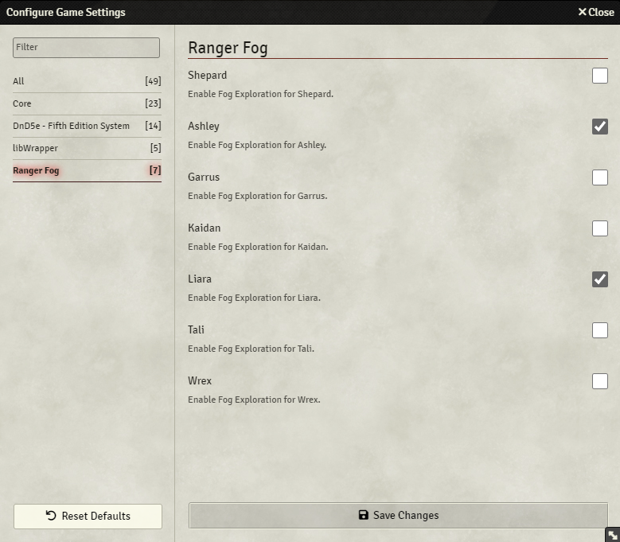

# Ranger Fog

An addon module for FoundryVTT that allows you to enable/disable Fog Exploration on a per-user basis. For example, you might want only Rangers or characters with the Keen Mind feat in D&D5e to be able to track where they've been.

## How to use

After enabling the module, open the module settings. There will be an individual checkbox for each user that you can use to enable Fog Exploration for them. Changing one of the options and saving again will refresh the canvas. If you disable a previously-enabled user's fog exploration and then re-enable it at a later date, their exploration progress will be saved.

NOTE: This will only work for scenes that have Fog Exploration enabled in the scene settings. If Fog Exploration is disabled in the scene settings, no users will be able to see explored areas.

  
Left: The user's Fog Exploration is disabled.  Right: The user's Fog Exploration is enabled.
